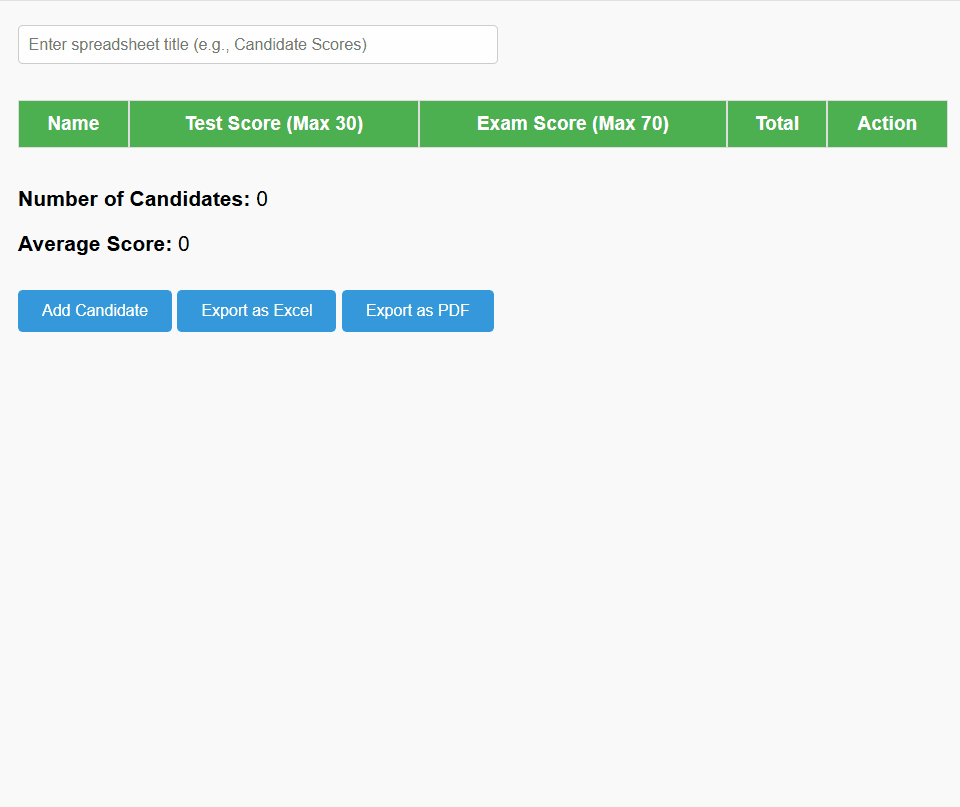

# 📊 ScoresheetApp
A clean, intuitive, and interactive scorekeeping web app built with **HTML**, **CSS**, and **JavaScript** — ideal for tracking test and exam scores in classrooms.

## 🌐 Live Demo
You can visit directly from your browser:
[Scoresheet App](https://rytvee.github.io/scoresheetapp/)

## ✨ Features
- ⚡ **Dynamic Score Updates** — Add scores and calculate average in real time.
- 👥 **Student Management** — Add students and track individual scores.
- 📱 **Responsive Design** — Works seamlessly on both desktop and mobile devices.
- 📤 **Export Scores** — Export scores as `PDF` or `Excel` file.

## 🛠️ Tech Stack
- 
- 
- 

## 🚀 Getting Started

```
git clone https://github.com/rytvee/scoresheetapp.git
cd scoresheetapp
open index.html
```

No setup or backend required — just load and use it.

## 📂 Project Structure
```text
scoresheetapp/
├── index.html      ← Main HTML file
├── styles.css      ← Styles and layout
├── script.js       ← Logic for score tracking and DOM manipulation
└── assets/         ← Icon, demo gif
```

## 📋 How to Use

 

## 📜 License
This project is free to use and modify.
